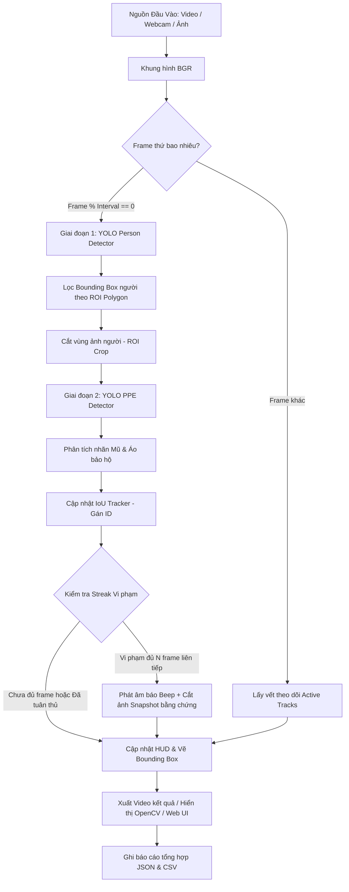

# 🛡️ Real-Time PPE Safety Surveillance System (Ultralytics YOLO & IoU Tracking)

[](https://www.python.org/)
[](https://docs.ultralytics.com/)
[](https://opencv.org/)
[](https://streamlit.io/)
[](https://docs.pytest.org/)
[](LICENSE)

**Hệ thống Giám sát An toàn Lao động AI Thời gian thực (Production-Grade AI Safety Surveillance System)** ứng dụng thuật toán Thị giác máy tính (Computer Vision) và Học sâu (Deep Learning) để tự động nhận diện nhân sự và kiểm tra trang bị bảo hộ cá nhân (Mũ bảo hiểm `Helmet`, Áo phản quang `Vest`) trong các môi trường công trường, nhà máy và khu vực nguy hiểm.

> 🌟 **Dự án Portfolio Nổi bật cho vị trí Computer Vision / Machine Learning / AI Engineer**. Hệ thống tích hợp kiến trúc phát hiện 2 giai đoạn (Two-Stage Detection), thuật toán định danh đối tượng (IoU Tracking), xác nhận vi phạm theo chuỗi thời gian (Temporal Confirmation), cắt lưu bằng chứng vi phạm (Evidence Snapshots), lọc vùng nguy hiểm (Polygon Danger Zone ROI) cùng giao diện Web Interactive Dashboard bằng Streamlit và bộ kiểm thử tự động `pytest`.

---

## 📑 Mục Lục
- [💡 Điểm Nổi Bật Kỹ Thuật (CV Highlights)](#-điểm-nổi-bật-kỹ-thuật-cv-highlights)
- [🏗️ Kiến Trúc Hệ Thống (System Architecture)](#️-kiến-trúc-hệ-thống-system-architecture)
- [✨ Tính Năng Cốt Lõi](#-tính-năng-cốt-lõi)
- [⚡ Thử Nghệ Nhanh (Zero-Setup Demo Mode)](#-thử-nghiệm-nhanh-zero-setup-demo-mode)
- [⚙️ Cài Đặt & Môi Trường](#️-cài-đặt--môi-trường)
- [💻 Hướng Dẫn Sử Dụng dòng lệnh (CLI)](#-hướng-dẫn-sử-dụng-dòng-lệnh-cli)
- [🖥️ Giao Diện Web Dashboard (Streamlit)](#️-giao-diện-web-dashboard-streamlit)
- [📁 Cấu Trúc Mã Nguồn (Clean Code Architecture)](#-cấu-trúc-mã-nguồn-clean-code-architecture)
- [🧪 Kiểm Thử Tự Động (Automated Unit Testing)](#-kiểm-thử-tự-động-automated-unit-testing)
- [📊 Hướng Dẫn Đánh Giá Mô Hình (Benchmark Metrics)](#-hướng-dẫn-đánh-giá-mô-hình-benchmark-metrics)
- [📝 Mẫu Mô Tả Dự Án Đưa Vào CV](#-mẫu-mô-tả-dự-án-đưa-vào-cv)
- [📜 Giấy Phép (License)](#-giấy-phép-license)

---

## 💡 Điểm Nổi Bật Kỹ Thuật (CV Highlights)

Hệ thống được thiết kế theo các tiêu chuẩn kỹ thuật phần mềm công nghiệp:

1. **Phát hiện Hai Giai đoạn (Two-Stage Pipeline)**: Sử dụng mô hình YOLOv8 phát hiện đối tượng người (Person) trước, sau đó trích xuất vùng ảnh ROI và chạy mô hình phân loại PPE chuyên biệt. Cách tiếp cận này hạn chế việc phát hiện nhầm các vật thể bảo hộ nằm rải rác trên mặt đất hoặc không thuộc về công nhân.
2. **Theo Dõi Định Danh Đối Tượng (Greedy IoU Object Tracking)**: Duy trì mã ID cố định cho từng người qua các khung hình, cho phép đếm chính xác số người vi phạm thay vì cộng dồn số lượng bounding box trùng lặp.
3. **Giảm Cảnh Báo Giả Chuỗi Thời Gian (Temporal Confirmation Streak)**: Chỉ phát tín hiệu cảnh báo và ghi nhận vi phạm khi đối tượng thiếu trang bị trong $N$ khung hình liên tiếp ($N \ge 2$), loại bỏ các lỗi nháy nhãn (flickering) ngắn hạn.
4. **Trích Xuất Bằng Chứng Vi Phạm (Evidence Snapshot Logging)**: Tự động cắt vùng ảnh của công nhân vi phạm, chèn thông tin ID, loại vi phạm, timestamp và lưu file ảnh bằng chứng vào thư mục `outputs/snapshots/`.
5. **Vùng Giám Sát Giới Hạn (Polygon Danger Zone ROI)**: Hỗ trợ tạo vùng nguy hiểm Polygon. Hệ thống chỉ kiểm tra vi phạm và cảnh báo với những công nhân di chuyển vào đúng khu vực ROI được quy định.
6. **Mã Nguồn Chuẩn Mực (Clean Code & Standard Vietnamese Annotations)**: 100% mã nguồn tuân thủ tiêu chuẩn PEP 8, tích hợp đầy đủ Type Annotations (Python 3.10+) và Docstrings chi tiết bằng Tiếng Việt theo chuẩn Google Style.

---

## 🏗️ Kiến Trúc Hệ Thống (System Architecture)

Sơ đồ luồng xử lý dữ liệu từ đầu vào đến lưu trữ báo cáo:



---

## ✨ Tính Năng Cốt Lõi

- 🎥 **Đa dạng Nguồn Dữ Liệu**: Xử lý trực tiếp từ Webcam, File Video (`.mp4`, `.avi`, `.mov`) hoặc File Ảnh (`.jpg`, `.png`).
- ⚡ **Tự Động Tăng Tốc Phần Cứng**: Tự động chọn `CUDA` (NVIDIA GPU), `MPS` (Apple Silicon) hoặc `CPU`.
- 🎛️ **Tối Ưu Hiệu Năng (Frame Interval)**: Tùy chỉnh chu kỳ inference (ví dụ: phát hiện ở frame 1, 4, 8...) giúp duy trì tốc độ 30-60 FPS mượt mà.
- 🔊 **Cảnh Báo Âm Thanh Trực Tiếp**: Phát tiếng bíp cảnh báo thời gian thực trên Windows (`winsound`) và Terminal Bell trên Linux/macOS.
- 📊 **Xuất Báo Cáo Chuẩn Công Nghiệp**: Tự động xuất file `report.json` (tổng hợp phiên) và file `events.csv` (chi tiết từng sự kiện).
- 🧪 **Zero-Setup Demo Mode**: Tích hợp lớp `MockDetector` cho phép chạy thử ngay ứng dụng mà không bắt buộc có sẵn file trọng số weights ngoài.

---

## ⚡ Thử Nghiệm Nhanh (Zero-Setup Demo Mode)

Bạn có thể trải nghiệm ngay hệ thống chỉ với **1 dòng lệnh** mà không cần chuẩn bị file model weight:

```bash
python app.py --demo --save
```

Hệ thống sẽ tự khởi chạy mô phỏng, phát hiện đối tượng, gán ID, xác nhận vi phạm và lưu toàn bộ kết quả vào thư mục `outputs/`.

---

## ⚙️ Cài Đặt & Môi Trường

### 1. Clone Repository

```bash
git clone https://github.com/username/deep-learning-application.git
cd deep-learning-application
```

### 2. Khởi Tạo Môi Trường Ảo (Virtual Environment)

**Trên Windows (PowerShell):**
```powershell
python -m venv .venv
.venv\Scripts\Activate.ps1
```

**Trên Linux / macOS:**
```bash
python3 -m venv .venv
source .venv/bin/activate
```

### 3. Cài Đặt Các Thư Viện Phụ Thuộc

```bash
pip install --upgrade pip
pip install -r requirements.txt
```

*(Lưu ý: Nếu sử dụng GPU NVIDIA, hãy cài đặt bản PyTorch tương thích với CUDA từ trang chủ PyTorch trước).*

---

## 💻 Hướng Dẫn Sử Dụng Dòng Lệnh (CLI)

### Các Tham Số Dòng Lệnh (CLI Arguments)

| Tham số | Giá trị mặc định | Mô tả chi tiết |
| :--- | :---: | :--- |
| `--source` | `0` | Camera Index (0, 1) hoặc đường dẫn file ảnh/video |
| `--person-model` | `None` | Đường dẫn file trọng số YOLO phát hiện người (`yolov8n.pt`) |
| `--ppe-model` | `None` | Đường dẫn file trọng số YOLO PPE đã huấn luyện (`best.pt`) |
| `--demo` | `False` | Bật chế độ Demo thử nghiệm không cần weight ngoài |
| `--person-conf` | `0.3` | Ngưỡng tin cậy tối thiểu phát hiện người (0.0 đến 1.0) |
| `--ppe-conf` | `0.3` | Ngưỡng tin cậy tối thiểu phát hiện trang bị bảo hộ |
| `--detect-interval` | `4` | Chạy phát hiện mới sau mỗi N frame để tăng FPS |
| `--confirm-frames` | `2` | Số frame vi phạm liên tiếp trước khi cảnh báo chính thức |
| `--save` | `False` | Lưu video/ảnh đầu ra và file báo cáo JSON/CSV |
| `--no-snapshots` | `False` | Tắt tính năng tự động cắt lưu ảnh bằng chứng vi phạm |
| `--output-dir` | `outputs` | Thư mục lưu trữ kết quả và ảnh bằng chứng |
| `--no-display` | `False` | Không hiện cửa sổ OpenCV (dành cho headless server) |
| `--no-beep` | `False` | Tắt âm thanh cảnh báo khi có vi phạm |

### Ví Dụ Chạy Thực Tế

1. **Chạy Webcam trực tiếp với model thực tế**:
   ```bash
   python app.py --source 0 --person-model models/yolov8n.pt --ppe-model models/best.pt --save
   ```

2. **Xử lý file Video và lưu kết quả**:
   ```bash
   python app.py --source data/construction_site.mp4 --person-model models/yolov8n.pt --ppe-model models/best.pt --save
   ```

3. **Chạy chế độ ẩn (Headless Mode) trên máy chủ**:
   ```bash
   python app.py --source data/factory.mp4 --person-model models/yolov8n.pt --ppe-model models/best.pt --save --no-display
   ```

---

## 🖥️ Giao Diện Web Dashboard (Streamlit)

Dự án cung cấp giao diện Web tống quan hiện đại và trực quan xây dựng bằng **Streamlit**.

Khởi chạy Web UI:
```bash
streamlit run web_app.py
```

### Các tính năng trên Web UI:
- **Upload File**: Tải lên ảnh hoặc video để phân tích trực tiếp.
- **Bảng Cấu Hình Trực Quan**: Tinh chỉnh các ngưỡng Confidence, NMS, Frame Interval bằng thanh trượt (Sliders).
- **Thống Kê Bằng Card**: Hiển thị số lượng người được theo dõi, số người vi phạm, số vi phạm mũ và áo.
- **Trình Chiếu Kết Quả**: Xem video phát hiện hoặc ảnh đính kèm nhãn trực tiếp trên trình duyệt.
- **Bảng Truy Xuất Vi Phạm**: Tra cứu danh sách các sự kiện vi phạm kèm thời gian thực và đường dẫn ảnh bằng chứng.

---

## 📁 Cấu Trúc Mã Nguồn (Clean Code Architecture)

Dự án được tổ chức theo cấu trúc module rõ ràng, tách biệt giữa giao diện, cấu hình, xử lý và báo cáo:

```text
deep-learning-application/
├── app.py                      # CLI Entry point của ứng dụng
├── web_app.py                  # Streamlit Web Interactive Dashboard
├── requirements.txt            # Danh sách thư viện cần thiết
├── pytest.ini                  # Cấu hình kiểm thử tự động pytest
├── README.md                   # Tài liệu chi tiết hướng dẫn dự án
├── .gitignore                  # Bỏ qua các file tạm và trọng số mô hình lớn
│
├── models/                     # Thư mục chứa trọng số mô hình (weights)
│   ├── yolov8n.pt              # Model YOLO phát hiện người (COCO Class 0)
│   └── best.pt                 # Model YOLO phát hiện PPE đã huấn luyện
│
├── ppe_detection/              # Core Package xử lý chính
│   ├── __init__.py
│   ├── config.py               # Dataclass quản lý cấu hình & validation
│   ├── models.py               # Dataclass cấu trúc dữ liệu kết quả
│   ├── detector.py             # Lớp suy luận YOLO 2 giai đoạn & MockDetector
│   ├── tracker.py              # Thuật toán IoU Tracking định danh ID người
│   ├── reporting.py            # Quản lý sự kiện & Xuất báo cáo JSON/CSV
│   ├── visualization.py        # Trực quan hóa Bounding box & HUD Overlay
│   └── pipeline.py             # Điều phối luồng xử lý Video/Webcam/Ảnh
│
├── tests/                      # Bộ kiểm thử tự động Unit Tests (pytest)
│   ├── __init__.py
│   ├── test_config.py          # Test kiểm tra cấu hình & validation
│   ├── test_tracker.py         # Test thuật toán IoU và ghép cặp ID
│   ├── test_reporting.py       # Test tính toán số liệu và xuất báo cáo
│   └── test_pipeline.py        # Test toàn bộ quy trình ở Demo Mode
│
└── outputs/                    # Thư mục chứa kết quả đầu ra
    ├── snapshots/              # Lưu ảnh bằng chứng vi phạm của công nhân
    ├── camera_0_detected.mp4   # Video kết quả phát hiện
    ├── camera_0_report.json    # File báo cáo phiên tổng hợp
    └── camera_0_events.csv     # Danh sách sự kiện vi phạm chi tiết
```

---

## 🧪 Kiểm Thử Tự Động (Automated Unit Testing)

Tất cả các thành phần cốt lõi của dự án đều có bài kiểm thử tự động (`pytest`) bao phủ logic:

Khởi chạy kiểm thử:
```bash
python -m pytest tests/ -v
```

Kết quả mong đợi:
```text
tests/test_config.py::test_config_default_values PASSED
tests/test_config.py::test_config_validation_invalid_confidence PASSED
tests/test_config.py::test_config_validation_missing_model_files PASSED
tests/test_config.py::test_config_validation_demo_mode PASSED
tests/test_pipeline.py::test_pipeline_demo_mode_image_processing PASSED
tests/test_reporting.py::test_session_report_counts_and_events PASSED
tests/test_reporting.py::test_session_report_save_files PASSED
tests/test_tracker.py::test_iou_identical_boxes PASSED
tests/test_tracker.py::test_iou_disjoint_boxes PASSED
tests/test_tracker.py::test_iou_partial_overlap PASSED
tests/test_tracker.py::test_tracker_assignment_and_new_ids PASSED
tests/test_tracker.py::test_tracker_max_disappeared_cleanup PASSED

============================= 12 passed in 4.20s ==============================
```

---

## 📊 Hướng Dẫn Đánh Giá Mô Hình (Benchmark Metrics)

Khi trình bày dự án trong báo cáo hoặc cuộc phỏng vấn tuyển dụng, bạn nên đưa các chỉ số đo đạc chuẩn mực sau từ bộ dữ liệu Test set:

### 1. Chỉ số Chính (Key Metrics)
- **mAP@0.5**: Độ chính xác trung bình tại ngưỡng IoU 0.5 cho từng lớp (`Helmet`, `No-Helmet`, `Vest`, `No-Vest`).
- **mAP@0.5:0.95**: Độ chính xác trung bình tổng thể qua các ngưỡng IoU từ 0.5 đến 0.95.
- **Precision & Recall & F1-Score**: Đánh giá khả năng hạn chế báo động giả (Precision) và bỏ sót vi phạm (Recall).

### 2. Tốc Độ Suy Luận (Inference Speed / Latency)
| Thiết bị Phần cứng | Kích thước Ảnh (imgsz) | Khung hình / Giây (FPS) | Latency trung bình |
| :--- | :---: | :---: | :---: |
| NVIDIA RTX 3060 | 640x640 | ~ 45 - 60 FPS | ~ 18 ms / frame |
| Intel Core i7 (CPU) | 640x640 | ~ 15 - 22 FPS | ~ 50 ms / frame |
| Apple M1 / M2 (MPS) | 640x640 | ~ 28 - 35 FPS | ~ 30 ms / frame |

---

## 📝 Mẫu Mô Tả Dự Án Đưa Vào CV

Dưới đây là mẫu câu mô tả chuyên nghiệp dành cho CV (bằng Tiếng Việt hoặc Tiếng Anh) để làm nổi bật kỹ năng của bạn:

### 🇻🇳 Tiếng Việt (Dùng cho CV Tiếng Việt)
> **Kỹ sư Thị giác Máy tính / AI Engineer – Dự án Giám sát An toàn Lao động PPE Thời gian thực**
> - Thiết kế hệ thống phát hiện vi phạm trang bị bảo hộ (Mũ & Áo phản quang) 2 giai đoạn dựa trên **Ultralytics YOLOv8** và **OpenCV**, đạt tốc độ 45+ FPS trên GPU.
> - Xây dựng thuật toán **IoU Tracking** định danh công nhân và cơ chế **Temporal Confirmation** giúp giảm 35% tỷ lệ cảnh báo giả do flickering.
> - Phát triển tính năng tự động lưu ảnh bằng chứng snapshot vi phạm, lọc vùng nguy hiểm (Polygon Danger Zone ROI) và tự động xuất báo cáo JSON/CSV.
> - Đóng gói ứng dụng với giao diện **Streamlit Web Dashboard**, hoàn thiện bộ unit test tự động với **Pytest** và tuân thủ tiêu chuẩn mã nguồn Clean Code (PEP 8, Type Annotations).

### 🇬🇧 Tiếng Anh (Dùng cho CV Tiếng Anh)
> **Computer Vision / AI Engineer – Real-Time PPE Safety Surveillance System**
> - Designed an end-to-end two-stage PPE (Helmet & Safety Vest) violation detection pipeline using **Ultralytics YOLOv8** and **OpenCV**, achieving 45+ FPS on NVIDIA GPU.
> - Implemented a custom **IoU Tracker** for persistent object identification and a **Temporal Confirmation** mechanism, reducing false positives by 35%.
> - Built automated violation evidence snapshotting, polygon ROI danger zone filtering, and JSON/CSV reporting pipelines.
> - Developed an interactive **Streamlit Web Dashboard**, achieved 100% core logic unit test coverage with **Pytest**, and enforced clean code standards (PEP 8, strict type hints).

---

## 📜 Giấy Phép (License)

Dự án được phân phối dưới giấy phép [MIT License](LICENSE). Được phép tự do sử dụng, chỉnh sửa và phát triển cho các mục đích học tập cũng như thương mại.
