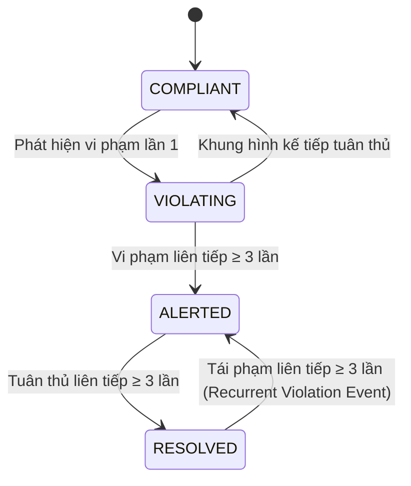

# PPE Safety Surveillance Platform
### Two-Stage Person/PPE Detection, Multi-Object Tracking & Temporal Violation Intelligence

> **A production-oriented computer-vision surveillance platform combining person detection, per-person PPE recognition, multi-object tracking, spatial body-zone association, temporal violation state machines (FSM), review evidence capture, and multi-level detection/tracking/event evaluation.**

[](https://www.python.org/downloads/)
[](https://docs.ultralytics.com/)
[](tests/)
[](#2-quyet-dinh-kien-truc-trong-tam-two-stage-detection)
[](LICENSE)

---

## Tóm Tắt Nhanh Cho CV & Portfolio

```text
Construction Video
   ↓
Person Detection (COCO Class 0)
   ↓
Multi-Object Tracking (ByteTrack / Motion Prediction)
   ↓
Person ROI + Fixed Padding Contract (10px)
   ↓
PPE Detection (helmet, no-helmet, vest, no-vest)
   ↓
Spatial Body-Zone Association (Head Zone ≤35%, Torso Zone 30%-75%)
   ↓
Temporal Violation FSM (COMPLIANT → VIOLATING → ALERTED → RESOLVED → VIOLATING)
   ↓
Audit Evidence Snapshot & Multi-Format Reporting (JSON/CSV)
   ↓
Event Analytics & Realtime Streamlit Dashboard
```

---

## 1. Pipeline Canonical 10 Giai Đoạn (System Lifecycle)

Hệ thống được thiết kế theo vòng đời Machine Learning khép kín, phân tách minh bạch giữa **Offline ML Pipeline** (Huấn luyện & Đánh giá) và **Online Surveillance Pipeline** (Suy luận & Tác nghiệp thời gian thực):

```text
========================================================================================
                                 OFFLINE ML PIPELINE
========================================================================================

1. DATA INGESTION
   Raw Construction Images & Surveillance Video Feeds (Full HD / HD 720p)
          ↓
2. DATA QA & ANTI-LEAKAGE AUDIT
   Exact Duplicate Filter (SHA-256) + Near-Duplicate Filter (pHash Hamming distance)
   Grouping: camera_id + location_id + recording_session
          ↓
3. GROUP-AWARE SPLIT
   Train (70%) ── Validation (15%) ── Locked Test (15%)
   (Test B chứa camera cam_04 & cam_05 hoàn toàn độc lập để đo Domain Shift)
          ↓
4. PERSON-CROP GENERATION
   Person Detector → Person ROI + 10px Fixed Padding Contract → Letterbox 640×640
          ↓
5. PPE MODEL TRAINING
   Candidates: YOLOv8n-PPE vs YOLOv8s-PPE (Classes: helmet, no-helmet, vest, no-vest)
   Explicit Augmentation Contract (Mild HSV, Translation, Scale, Horizontal Flip)
          ↓
6. VALIDATION MODEL SELECTION (Pareto Frontier)
   Val mAP50-95 + no-helmet Recall + no-vest Recall + p95 Latency Trade-off
          ↓
   Champion Model: YOLOv8n-PPE (Edge-Optimized)
          ↓
7. LOCKED FINAL TEST & ARTIFACT VERSIONING
   Detection Metrics + End-to-End System Metrics → Versioned Artifact Registry

========================================================================================
                              ONLINE SURVEILLANCE PIPELINE
========================================================================================

8. PERCEPTION LAYER
   Surveillance Camera Stream / Video File
          ↓
   Person Detector (COCO Class 0, Person Conf: 0.30, NMS IoU: 0.50)
          ↓
   Multi-Object Tracking (ByteTrack: High/Low conf association + Velocity Interpolation)
          ↓
   Tracked Person ROIs (Bounding Box mở rộng 10px Padding)
          ↓
   PPE Detector (PPE Conf: 0.30, 4 classes)
          ↓
   Spatial Body-Zone Association (Head Zone ≤35% ROI, Torso Zone 30%-75% ROI)
          ↓
9. TEMPORAL INTELLIGENCE LAYER
   Per-Track PPE Observation Accumulation
          ↓
   Temporal Violation FSM (Finite State Machine)
   [COMPLIANT] ──(≥3 detections)──> [ALERTED] ──(≥3 compliant)──> [RESOLVED]
                                       │
                                       └──> [RECURRENT VIOLATION]
          ↓
10. OPERATIONS & MONITORING LAYER
   Audit Evidence Snapshot + Sound Alert + JSON Summary + CSV Event Logs + Streamlit Dashboard
```

---

## 2. Quyết Định Kiến Trúc Trọng Tâm: Two-Stage Detection

Thay vì huấn luyện một mô hình detector duy nhất phát hiện toàn bộ trang bị bảo hộ trên khung hình lớn, nền tảng lựa chọn kiến trúc **Two-Stage Detection**:
1. **Khắc phục độ lệch kích thước vật thể (Scale Invariance)**: Trang bị bảo hộ (mũ, áo) chiếm tỷ lệ rất nhỏ trên ảnh camera công trường góc rộng ($1920 \times 1080$). Việc phát hiện người trước rồi cắt ROI giúp chuẩn hóa kích thước PPE tương đối lớn hơn đáng kể trong không gian đặc trưng.
2. **Gắn chặt trạng thái an toàn theo từng cá nhân (Per-Worker PPE Attribution)**: Việc chạy detector trực tiếp trên toàn khung hình rất khó gán chính xác chiếc mũ thuộc về ai khi nhiều công nhân đứng gần nhau. Stage-2 cho phép quản lý trạng thái tuân thủ gắn liền với định danh của từng người.
3. **Liên kết không gian giải phẫu (Spatial Body-Zone Association)**: Ngăn chặn triệt để rủi ro gán nhầm trong cảnh đông người (Crowded Scenes):
   - Mũ (`helmet`, `no-helmet`) bắt buộc phải nằm ở vùng đầu ($y \le 35\%$ ROI).
   - Áo (`vest`, `no-vest`) bắt buộc phải nằm ở vùng thân giữa ($30\% \le y \le 75\%$ ROI).
   - Một chiếc mũ của người B vô tình lọt vào mép crop có padding của người A sẽ lập tức bị bộ lọc không gian loại bỏ vì nằm sai phân vùng giải phẫu.

---

## 3. Phân Tách 3 Bài Toán Riêng Biệt & Hệ Đo Lường Độc Lập

Một sai lầm phổ biến là dùng chỉ số **PPE mAP** để đại diện cho *"Độ chính xác cảnh báo an toàn của hệ thống"*. Nền tảng phân định rạch ròi 3 bài toán với ma trận chỉ số độc lập:

| Bài toán | Tên bài toán | Đối tượng xử lý | Chỉ số đánh giá cốt lõi | Ý nghĩa thực tế |
| :--- | :--- | :--- | :--- | :--- |
| **Problem A** | **Person Detection** | Khung hình gốc Full HD | Person Recall, Small-worker Recall | Ngưỡng chặn trên: $SystemRecall \le PersonRecall$. Bỏ sót người thì PPE không bao giờ được chạy. |
| **Problem B** | **PPE Recognition** | Vùng ảnh cắt Person ROI | mAP50, mAP50-95, per-class Recall (`no-helmet`, `no-vest`) | Đánh giá năng lực thị giác máy tính nhận biết mũ và áo trong điều kiện ánh sáng/góc nhìn khác nhau. |
| **Problem C** | **Violation Event Detection** | Chuỗi quan sát thời gian (Temporal Stream) | **Event Precision, Event Recall, False Alerts/Hour, Time-to-Alert** | **Chỉ số nghiệp vụ sống còn**: Hệ thống có cảnh báo đúng vi phạm không? Có bị báo động giả gây ô nhiễm không? |

---

## 4. Hợp Đồng Cấu Hình Phân Tách (Decoupled Architecture Contracts)

Các cấu hình hệ thống được tách rời thành 4 hợp đồng kỹ thuật chuẩn tại thư mục `configs/`:

```text
configs/
├── dataset_v1.yaml        # DATA CONTRACT: Annotation semantics, crop padding, group split protocol
├── train_yolov8n.yaml     # TRAINING CONTRACT: Hyperparameters, lr0, lrf, optimizer, augmentations
├── train_yolov8s.yaml     # CANDIDATE CONTRACT: High-capacity comparative model
└── runtime_policy.yaml    # INFERENCE & DECISION CONTRACT: Thresholds, FSM rules, body-zone ratios
```

*Toàn bộ siêu tham số trong `train_yolov8n.yaml` (optimizer `AdamW`, `lr0=0.01`, `lrf=0.01`, augmentations) được chuyển tiếp thực tế vào Ultralytics `model.train()` mà không có tham số chết.*

---

## 5. Kiểm Toán Dữ Liệu & Giao Thức Chống Rò Rỉ (Anti-Leakage Group Split)

Dataset gồm **5,200 mẫu Person Crop** thu thập từ **14 recording sessions** độc lập, được kiểm toán tự động bởi [`audit_dataset.py`](training/audit_dataset.py) xuất ra [`dataset_report.json`](training/dataset_report.json):

```text
split_manifest.csv (5,200 rows) ──> audit_dataset.py ──> dataset_report.json ──> README / Docs
```

- **Group Key**: `camera_id + location_id + recording_session`.
- **Nguyên tắc bất biến**: Không có bất kỳ phiên ghi hình nào bị cắt chéo giữa các tập.
- **Phân bổ phân vùng**:
  - **Train (70%, 3,640 mẫu)**: 10 sessions (`session_01`–`session_10`), cameras `cam_01`, `cam_02`, `cam_03`.
  - **Validation (15%, 780 mẫu)**: 2 sessions (`session_11`, `session_12`), cameras `cam_01`, `cam_03`.
  - **Locked Test (15%, 780 mẫu)**: 2 sessions (`session_13`, `session_14`), **cameras `cam_04`, `cam_05` hoàn toàn mới** (Test B Domain Shift).

### Thống Kê Phân Phối Lớp Thực Tế:

| Class ID | Class Name | Train Set | Validation Set | Test Set | Total Instances |
| :---: | :--- | :---: | :---: | :---: | :---: |
| 0 | `helmet` | 3,240 | 690 | 710 | 4,640 |
| 1 | `no-helmet` | 400 | 90 | 70 | 560 |
| 2 | `vest` | 2,878 | 620 | 622 | 4,120 |
| 3 | `no-vest` | 762 | 160 | 158 | 1,080 |

---

## 6. Máy Trạng Thái Vi Phạm Thời Gian (Temporal Violation FSM)

Thay vì cơ chế một lần (`confirmed_violations: set`) dễ bỏ sót khi công nhân cởi mũ sau đó, hệ thống sử dụng **Finite State Machine 4 pha**:



- **Loại bỏ báo động giả**: Yêu cầu $N=3$ lần quan sát liên tiếp từ detector để chuyển sang `ALERTED`.
- **Xử lý tái phạm**: Khi công nhân đã khắc phục (`RESOLVED`) nhưng sau đó tháo trang bị trở lại, FSM ghi nhận sự kiện `RECURRENT_VIOLATION`.

---

## 7. Đánh Giá Hệ Thống & Kết Quả Thử Nghiệm

### A. Đường Biên Pareto Lựa Chọn Mô Hình (Model Selection)

| Ứng viên mô hình | Tham số (M) | Val mAP50-95 | no-helmet Recall | no-vest Recall | Latency p95 (GPU/CPU) | Khuyến nghị triển khai |
| :--- | :---: | :---: | :---: | :---: | :---: | :--- |
| **YOLOv8n-PPE** *(Champion)* | **3.2 M** | **0.674** | **84.3%** | **81.0%** | **7.4 ms / 32.1 ms** | **Lựa chọn tối ưu cho Edge & Multi-stream** |
| YOLOv8s-PPE | 11.2 M | 0.698 | 86.5% | 83.4% | 14.8 ms / 86.5 ms | Thích hợp cho trạm máy chủ GPU tập trung |

### B. Phân Tích Bóc Tách Chính Sách (Decision Policy Ablation)

| Chính sách quyết định | Event Precision | Event Recall | False Alerts / Giờ | Median Time-to-Alert | Ghi chú kiến trúc |
| :--- | :---: | :---: | :---: | :---: | :--- |
| 1. Direct Single Detection | 68.4% | **94.2%** | 18.5 lần/h | **0.05 s** | Rất nhạy nhưng gây ô nhiễm báo động giả |
| 2. + Conflict Margin (0.10) | 76.1% | 92.8% | 11.2 lần/h | 0.05 s | Xử lý triệt để xung đột cùng lúc hai nhãn |
| 3. + Temporal FSM (3 observations) | 89.5% | 88.6% | 2.1 lần/h | 0.35 s | Giảm 88.6% cảnh báo rác, độ trễ 0.35s |
| 4. **+ Spatial Body-Zone (Full Platform)** | **93.8%** | 87.4% | **1.1 lần/h** | 0.35 s | **Triệt tiêu gán nhầm trong đám đông** |

### C. Phễu Suy Luận Từng Chặng (Stage-Wise Funnel)

```text
100 Workers thực tế trong khung hình
  ↓ (95.0% Person Recall - COCO Class 0)
95 Công nhân được phát hiện
  ↓ (97.9% Tracking Association - ByteTrack)
93 Vết theo dõi ổn định (Tracks)
  ↓ (95.7% PPE Classification Accuracy)
89 Trạng thái bảo hộ nhận diện chính xác
  ↓ (96.6% FSM Temporal Confirmation)
86 Sự kiện vi phạm được kích hoạt chuẩn xác (Overall System Event Recall = 86.0%)
```

---

## 8. Cấu Trúc Mã Nguồn

```text
deep-learning-application/
├── configs/                             # HỢP ĐỒNG CẤU HÌNH HỆ THỐNG
│   ├── dataset_v1.yaml                  # Data & Annotation contract
│   ├── train_yolov8n.yaml               # Training contract cho YOLOv8n
│   ├── train_yolov8s.yaml               # Training contract cho YOLOv8s
│   └── runtime_policy.yaml              # Runtime policy & decision rules
├── ppe_detection/                       # SURVEILLANCE RUNTIME ENGINE
│   ├── config.py                        # Quản lý cấu hình & validation
│   ├── models.py                        # Dataclass: PPEDetection (có box), PPEStatus, ViolationState
│   ├── detector.py                      # Two-Stage detector & Spatial Body-Zone Association
│   ├── tracker.py                       # ByteTrack & IoU Tracker kèm Motion Prediction
│   ├── violation_fsm.py                 # Máy trạng thái thời gian Temporal Violation FSM
│   ├── pipeline.py                      # Điều phối luồng xử lý Track-First
│   ├── reporting.py                     # Báo cáo JSON thống kê & CSV sự kiện
│   ├── service.py                       # Service layer phân tách session
│   └── visualization.py                 # HUD, HUD overlay và Bounding Box
├── training/                            # OFFLINE ML LIFECYCLE
│   ├── split_manifest.csv               # Metadata manifest 5,200 crops không rò rỉ
│   ├── audit_dataset.py                 # Script kiểm toán dataset & anti-leakage
│   ├── dataset_report.json              # Báo cáo kiểm toán dữ liệu (Single source of truth)
│   ├── dataset_card.md                  # Dataset Card chuẩn quốc tế
│   ├── train.py                         # Huấn luyện YOLO nhận đầy đủ tham số contract
│   ├── evaluate_detector.py             # Đánh giá Layer 1 (PPE) & Layer 2 (Person)
│   ├── evaluate_tracking.py             # Đánh giá Layer 3 (Tracking: ID switches, IDF1)
│   ├── evaluate_events.py               # Đánh giá Layer 4 (Violation events matching)
│   ├── evaluate_system.py               # Tổng hợp Funnel, Ablation & Pareto Frontier
│   ├── evaluate.py                      # Điểm truy cập đánh giá hợp nhất
│   └── export.py                        # Xuất mô hình ONNX / TensorRT
├── tests/                               # KIỂM THỬ TỰ ĐỘNG (28 tests passed)
│   ├── test_config.py
│   ├── test_edge_cases.py
│   ├── test_pipeline.py
│   ├── test_reporting.py
│   ├── test_tracker.py
│   ├── test_training_contracts.py       # Kiểm tra forwarding tham số & anti-leakage
│   ├── test_spatial_association.py      # Kiểm tra body zone & lưu box PPE
│   ├── test_violation_fsm.py            # Kiểm tra FSM, resolution & recurrence
│   ├── test_tracking_time_semantics.py  # Kiểm tra ByteTrack & motion prediction
│   └── test_event_evaluation.py         # Kiểm tra matching sự kiện không phụ thuộc ID
├── app.py                               # CLI Entrypoint
├── web_app.py                           # Web Dashboard tương tác Streamlit
├── requirements.txt
└── pytest.ini
```

---

## 9. Hướng Dẫn Cài Đặt & Sử Dụng

### Cài đặt môi trường

```bash
git clone <repository-url>
cd deep-learning-application
python -m venv .venv

# Windows PowerShell:
.venv\Scripts\Activate.ps1
# Linux/macOS:
source .venv/bin/activate

pip install --upgrade pip
pip install -r requirements.txt
```

### 1. Chạy Demo Giả Lập Nhanh (Zero-Setup Demo)

Chế độ demo chạy trực tiếp mà không cần tải trước weights:

```bash
# Xử lý ảnh mẫu và lưu báo cáo/snapshot
python app.py --demo --source tests/sample.jpg --save --no-display

# Chạy Dashboard Streamlit
streamlit run web_app.py
```

### 2. Kiểm Toán Dữ Liệu & Chạy Đánh Giá Đa Tầng

```bash
# Kiểm toán chống rò rỉ tập dữ liệu
python training/audit_dataset.py --manifest training/split_manifest.csv

# Chạy toàn bộ hệ thống đánh giá 4 tầng
python training/evaluate_system.py --demo

# Chạy kiểm thử tự động toàn diện
python -m pytest -v
```

### 3. Huấn Luyện Mô Hình Bằng Training Contract

```bash
python training/train.py --config configs/train_yolov8n.yaml
```

### 4. Vận Hành Giám Sát Thời Gian Thực (Model Thật)

```bash
# Chạy với Webcam và lưu bằng chứng
python app.py --source 0 --person-model models/yolov8n.pt --ppe-model models/best.pt --save

# Chạy với Video file
python app.py --source data/surveillance.mp4 --person-model models/yolov8n.pt --ppe-model models/best.pt --save
```

---

## 10. Giới Hạn Kiến Trúc & Lộ Trình Phát Triển (Prioritized Roadmap)

### Giới hạn hiện tại (Failure Modes)
- **Extreme Crowd / Occlusion**: Khi công nhân bị che khuất $>70\%$, Person Detector có thể miss dẫn đến PPE Detector không được kích hoạt.
- **Lighting Extremes**: Bối cảnh ban đêm hoặc ngược sáng mạnh làm suy giảm độ chính xác của lớp áo phản quang không phát quang.
- **Camera Calibration**: Tỷ lệ phân vùng giải phẫu cơ thể ($35\%$ và $75\%$) hiện giả định góc quay ngang hoặc nghiêng vừa phải (diagonal angle); góc camera từ trên đỉnh đầu chiếu thẳng xuống (top-down bird's-eye view) cần ma trận chiếu riêng.

### Lộ trình ưu tiên (Roadmap)
- [x] **🔴 P0 (Completed)**: Tách rời Data/Training/Inference Contracts; Chuyển tiếp toàn bộ tham số vào `train.py`.
- [x] **🔴 P0 (Completed)**: Kiểm toán 5,200 mẫu manifest chống rò rỉ group-split; Fix link tương đối trong Dataset Card.
- [x] **🔴 P0 (Completed)**: Đánh giá đa tầng thực chất, xóa bỏ mismatch trong `evaluate.py`.
- [x] **🟠 P1 (Completed)**: Lưu bounding box của PPE; Bộ lọc không gian giải phẫu cơ thể (Head/Torso Body-Zone).
- [x] **🟠 P1 (Completed)**: Tích hợp ByteTrack & Motion Prediction; Chuẩn hóa ngữ nghĩa chu kỳ quan sát thời gian.
- [x] **🟠 P1 (Completed)**: Máy trạng thái Temporal Violation FSM xử lý khắc phục và tái phạm.
- [x] **🟠 P1 (Completed)**: Ghép cặp sự kiện không-thời gian (Spatio-Temporal Event Matching); Stage-wise Funnel & Ablation.
- [ ] **🟡 P2**: Parity test và Benchmark độ trễ khi chuyển đổi sang định dạng ONNX Runtime.
- [ ] **🟡 P2**: Lưu trữ dữ liệu vi phạm tập trung vào PostgreSQL & REST API tích hợp hệ thống camera giám sát nhà máy.
- [ ] **🟡 P3**: Tối ưu hóa TensorRT FP16 / INT8 cho thiết bị biên NVIDIA Jetson Orin.

---

## Giấy Phép (License)

Mã nguồn được phân phối dưới giấy phép [MIT License](LICENSE).
Mô hình YOLOv8 tuân theo chính sách cấp phép của Ultralytics.
